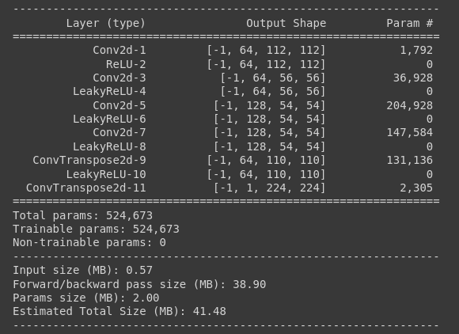

# Image Segmentation on a large scale fish dataset

Performed image segmenatation on the [large scale fish dataset](https://www.kaggle.com/crowww/a-large-scale-fish-dataset)

## Data Preprocessing

Images in the dataset were already augmented.

- Used [Scikit-learn](https://scikit-learn.org/stable/) to split the dataset into train/test sets.

- Used PyTorch's [Dataset class](https://pytorch.org/tutorials/beginner/data_loading_tutorial.html) to create my own Custom Fish Dataset as the images and their masks were not arranged as per my needs.

- Resized the Images to 224x224 pixels and converted them to Tensors, to perform these trasnformations I used a library called [Albumentations](https://albumentations.ai/)

- Created a custom DataLoader with a batch size of 32

## Neural Network

Used a [UNet architecture](https://towardsdatascience.com/unet-line-by-line-explanation-9b191c76baf5) to implement image segmentation.

## Training and Testing

The model was trained for 5 Epochs over the train dataset yielding:
| Average Epoch Accuracy | Average Epoch Loss | Epoch |
| :--------------------: | :----------------: | :---: |
| 61.4% | 0.209 | 1 |
| 83.5% | 0.0788 | 2 |
| 85.8% | 0.0673 | 3 |
| 86.5% | 0.0635 | 4 |
| 87% | 0.061 | 5 |

> Average training Accuracy was 80.85%

_To predict the accuracy I used the [IoU (Intersection over Union) metric](https://www.pyimagesearch.com/2016/11/07/intersection-over-union-iou-for-object-detection/)_

The model was then tested using the test dataset yielding:

> Average accuracy of 86.69%

## List of libraries used

- [numpy](https://numpy.org/)
- [pandas](https://pandas.pydata.org/)
- [PyTorch](https://pytorch.org/)
- [tqdm](https://tqdm.github.io/)
- [albumentations](https://albumentations.ai/)
- [scikit-learn](https://scikit-learn.org/stable/)
- [pathlib](https://pathlib.readthedocs.io/en/pep428/)
- [pillow](https://pillow.readthedocs.io/en/stable/)
